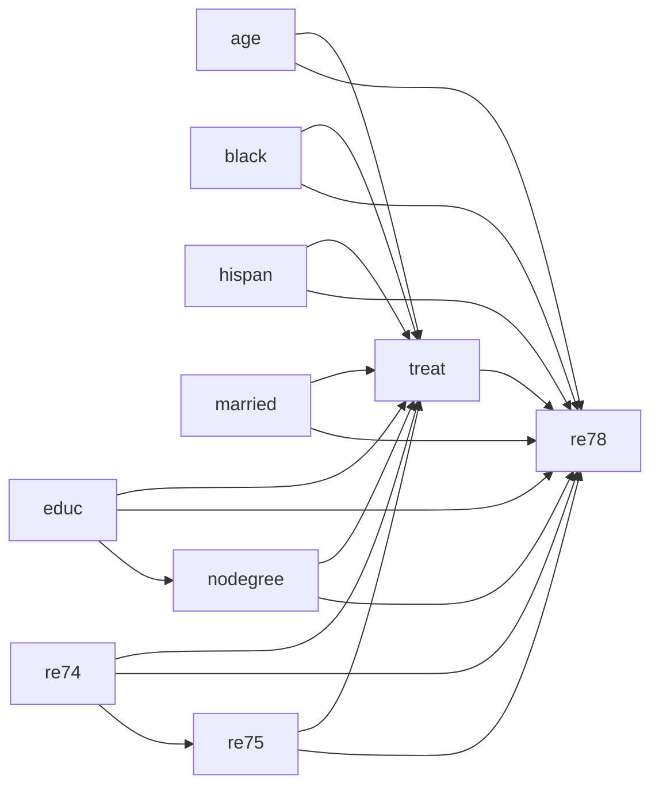

# Handoff - Examen Final Interpretabilidad y Causalidad

## Objetivo del proyecto

Resolver el examen final de `interpretabilidad_causalidad/m06` en un notebook entregable completo.

El examen pide trabajar con el dataset clasico de LaLonde para:

1. Identificar tratamiento, estimar propensity score, diagnosticar solapamiento/positividad, construir pesos IPW para ATE, ajustar modelo de resultados, calcular ATE/ATT, comparar con y sin IPW, construir DAG y determinar conjunto backdoor.
2. Responder si el teorema de Frisch-Waugh-Lovell prohibe la paradoja de Simpson, con razonamiento matematico o experimentos documentados.
3. Calcular ATE mediante Double Machine Learning y comparar el resultado con lo anterior.

El flujo acordado con el usuario es:

```text
pregunta -> analisis conceptual -> desarrollo en notebook
```

No avanzar con codigo de una pregunta hasta cerrar su analisis conceptual.

## Ubicacion de archivos

Carpeta principal del modulo:

```text
/Users/rmz/workspace/bourbaki/data-science-portfolio/interpretabilidad_causalidad/m06
```

Archivos importantes:

```text
interpretabilidad_causalidad/m06/data/input/Datos Lalonde.csv
interpretabilidad_causalidad/m06/Evaluación Final Interpetabilidad y Causalidad.pdf
interpretabilidad_causalidad/m06/Interpretabilidad y Causalidad en ML.pdf
interpretabilidad_causalidad/m06/Interpretabilidad y Causalidad II.pdf
interpretabilidad_causalidad/m06/Interpretabilidad y Causalidad IV - Bourbaki.pdf
interpretabilidad_causalidad/m06/info/www.colegio-bourbaki.com.har
interpretabilidad_causalidad/m06/info/www.colegio-bourbaki.com-videos.har
```

Notebook creado hasta ahora:

```text
interpretabilidad_causalidad/m06/notebooks/pregunta_1_lalonde.ipynb
```

Graficos generados:

```text
interpretabilidad_causalidad/m06/data/output/pregunta1/propensity_overlap.png
interpretabilidad_causalidad/m06/data/output/pregunta1/balance_smd.png
```

El notebook `pregunta_1_lalonde.ipynb` fue ejecutado con `nbconvert` y corrio sin errores.

## Decision sobre notebook final

El usuario pregunto como entregar si el examen debe ser un notebook completo. La recomendacion acordada fue:

```text
interpretabilidad_causalidad/m06/notebooks/examen_final_lalonde.ipynb
```

Estructura sugerida:

```text
# Examen Final - Interpretabilidad y Causalidad

## Preparacion general
- Imports
- Carga de datos
- Validacion del dataset
- Definicion de D, Y, X
- Nota NSW vs PSID

## Pregunta 1
- Propensity score
- IPW
- Modelo de resultados
- ATE/ATT
- DAG/backdoor

## Pregunta 2
- FWL vs paradoja de Simpson
- Desarrollo matematico
- Experimentos documentados si conviene

## Pregunta 3
- Double Machine Learning
- Comparacion con resultados anteriores
- Conclusion final
```

Siguiente paso recomendado: copiar/fusionar el contenido de `pregunta_1_lalonde.ipynb` dentro de `examen_final_lalonde.ipynb` y continuar debajo con pregunta 2. Alternativamente, seguir usando notebooks por pregunta como borradores y fusionar al final, pero el usuario parece preferir un notebook completo.

## Trampa conceptual detectada

Punto critico: no tratar este archivo como el experimento NSW puro.

En `Datos Lalonde.csv`:

```text
NSW: 185 tratados, 0 controles
PSID: 0 tratados, 429 controles
```

Es decir:

```text
ID con prefijo NSW  -> treat = 1
ID con prefijo PSID -> treat = 0
```

Por lo tanto, para este examen el analisis debe tratarse como estudio observacional NSW tratados vs PSID controles, no como ensayo aleatorizado puro.

Esto es importante porque una respuesta generica de LLM podria decir "LaLonde es experimental; backdoor vacio". Para este archivo, eso seria incorrecto.

## Variables correctas

Definiciones consolidadas:

```text
D = treat
Y = re78
X = {age, educ, black, hispan, married, nodegree, re74, re75}
```

Nombres exactos del CSV:

```text
ID
treat
age
educ
black
hispan
married
nodegree
re74
re75
re78
```

Ojo: la columna es `hispan`, no `hispanic`.

## Cosas que NO deben hacerse

No usar como covariable:

```text
ID
source
prefijo NSW/PSID derivado de ID
re78
```

Razones:

- `ID`/`source` codifica el origen de muestra y separa perfectamente tratados y controles.
- `re78` es el outcome posterior al tratamiento.
- Incluir `ID` o `source` puede causar separacion perfecta en propensity score y es metodologicamente incorrecto.
- Incluir `re78` como covariable seria ajustar por el resultado.

## Advertencias metodologicas que deben aparecer en el entregable

Incluir una nota parecida a esta:

```markdown
Aunque LaLonde suele asociarse con el experimento NSW, el archivo usado aqui no corresponde al ensayo experimental puro. Los individuos tratados tienen identificadores `NSW`, mientras que los controles tienen identificadores `PSID`. Por lo tanto, este analisis se trata como un estudio observacional con tratados NSW y controles PSID. El efecto causal no se identifica por aleatorizacion simple, sino bajo el supuesto de ignorabilidad condicional dado el conjunto de covariables pretratamiento:

`X = {age, educ, black, hispan, married, nodegree, re74, re75}`.

No se utiliza `ID` como covariable porque codifica el origen de la muestra y separa perfectamente tratamiento/control. Tampoco se ajusta por `re78`, ya que es la variable de resultado posterior al tratamiento.
```

Tambien dejar claro:

```text
La identificacion causal depende de ignorabilidad condicional y positividad.
El solapamiento NSW/PSID es imperfecto.
IPW puede ser sensible a pesos extremos.
Si estimadores difieren mucho, interpretarlo como sensibilidad a metodo/supuestos, no como simple contradiccion.
```

## Resultados numericos obtenidos en pregunta 1

Del notebook ejecutado:

```text
n = 614
tratados = 185
controles = 429
```

Propensity score:

```text
AUC del modelo de propension ~= 0.874
```

Esto confirma que las covariables distinguen bastante bien tratados de controles; hay solapamiento imperfecto.

Pesos ATE:

```text
max weight ~= 37.24
```

Algunos resultados calculados:

```text
Diferencia cruda              ~= -635.03
ATE IPW                      ~= -536.17
ATE IPW normalizado          ~= 232.42
ATT IPW                      ~= 1214.78
ATE modelo de resultados     ~= 1548.24
ATT modelo de resultados     ~= 1548.24
ATE modelo resultados + IPW  ~= 732.64
ATT modelo resultados + IPW  ~= 732.64
```

La diferencia entre ATE IPW no normalizado y normalizado debe comentarse como sensibilidad a pesos/solapamiento.

Balance SMD antes/despues de IPW:

```text
age       -0.242 -> -0.171
educ       0.045 ->  0.131
black      1.668 ->  0.127
hispan    -0.277 ->  0.023
married   -0.719 -> -0.208
nodegree   0.235 -> -0.100
re74      -0.596 -> -0.275
re75      -0.287 -> -0.160
```

IPW mejora mucho el balance en `black`, `hispan`, `nodegree`, pero no deja todas las covariables perfectamente balanceadas.

## DAG y backdoor acordados

DAG conceptual:



Conjunto backdoor:

```text
{age, educ, black, hispan, married, nodegree, re74, re75}
```

Notas:

- `educ -> nodegree`, porque `nodegree` esta derivada/relacionada con educacion.
- `re74 -> re75`, porque ingreso previo mas antiguo afecta ingreso previo mas reciente.
- `ID` no aparece en el DAG causal sustantivo.

## Relacion con transcripciones/videos

Se revisaron los HAR en `interpretabilidad_causalidad/m06/info`.

Los videos/transcripciones de I&C contienen y respaldan:

- Propensity score como propension/probabilidad de recibir tratamiento.
- Inverse probability weighting.
- Pesos tipo tratados `1 / propensity`, controles `1 / (1 - propensity)`.
- Idea de reponderar para hacer la comparacion mas parecida a un A/B testing.
- DAG como lenguaje causal.
- Backdoor, D-separacion y confounders.
- Simpson.
- Frisch-Waugh-Lovell, Double Machine Learning y DML.

Frase de estilo de clase que conviene incorporar:

```text
El puntaje de propension permite reponderar la poblacion para hacer la comparacion entre tratados y controles mas parecida a una asignacion aleatoria o A/B testing.
```

## Estado actual de pregunta 1

Conceptualmente cerrada y desarrollada en:

```text
interpretabilidad_causalidad/m06/notebooks/pregunta_1_lalonde.ipynb
```

Incluye:

- Carga/validacion de datos.
- Confirmacion NSW vs PSID.
- Definicion de tratamiento, outcome y covariables.
- Nota metodologica sobre el dataset.
- Propensity score.
- Grafico de solapamiento.
- Pesos IPW ATE/ATT.
- Diagnostico de pesos extremos.
- Balance por SMD.
- Estimadores IPW.
- Modelo de resultados.
- Comparacion de resultados.
- DAG.
- Backdoor.

Verificacion:

```text
jupyter nbconvert --to notebook --execute pregunta_1_lalonde.ipynb --inplace --ExecutePreprocessor.timeout=120
```

Corrio sin errores.

## Lo ultimo que se estaba discutiendo

El usuario pregunto como manejar que el examen se entregue como notebook completo si estamos separando por pregunta.

Respuesta propuesta:

- Crear `examen_final_lalonde.ipynb` como notebook final unico.
- Usar `pregunta_1_lalonde.ipynb` como bloque fuente o borrador.
- Agregar pregunta 2 y pregunta 3 debajo en el mismo notebook final.

No se ha creado todavia `examen_final_lalonde.ipynb`.

## Lo que falta

### Pendiente inmediato

1. Crear `interpretabilidad_causalidad/m06/notebooks/examen_final_lalonde.ipynb`.
2. Fusionar/copiar la pregunta 1 ya ejecutada dentro del notebook final.
3. Revisar que las rutas sigan funcionando desde `m06/notebooks`.

### Pregunta 2 - analisis pendiente

Responder:

```text
¿El teorema de Frisch-Waugh-Lovell prohibe el fenomeno paradojico de Simpson?
```

Orientacion conceptual ya conversada:

```text
FWL no prohibe Simpson.
FWL explica algebraicamente como cambia el coeficiente de X al residualizar/controlar covariables Z en un modelo lineal.
Simpson surge cuando una asociacion agregada cambia de direccion al condicionar por una variable de estratificacion/confusion.
FWL puede mostrar el mecanismo lineal de ese cambio: el coeficiente ajustado es el efecto de la parte de X ortogonal a Z sobre la parte de Y ortogonal a Z.
Pero no impide que el signo agregado y el signo condicionado difieran.
```

Conviene incluir:

- Una explicacion matematica con regresion simple vs regresion con covariables.
- Una version residualizada por FWL.
- Un ejemplo pequeno o simulacion documentada donde el signo agregado difiere del ajustado.
- Conectar con causalidad: el signo correcto depende del DAG/conjunto de ajuste, no solo del algebra.

No escribir codigo de pregunta 2 hasta cerrar con el usuario el analisis conceptual, siguiendo el ritmo acordado.

### Pregunta 3 - analisis pendiente

Calcular ATE mediante Double Machine Learning.

Orientacion:

```text
D = treat
Y = re78
X = covariables pretratamiento
```

Implementacion esperada:

- Cross-fitting.
- Modelo para outcome `m(X) = E[Y | X]`.
- Modelo para tratamiento `g(X) = E[D | X]` o propensity.
- Residuales:

```text
Y_res = Y - m_hat(X)
D_res = D - g_hat(X)
```

- Regresion final:

```text
Y_res ~ D_res
```

- Coeficiente de `D_res` como ATE DML parcialmente lineal.

Debe compararse con resultados de pregunta 1, especialmente outcome model/IPW. La pregunta 3 dice "compara tu resultado con tu respuesta de la pregunta 2", pero la pregunta 2 es conceptual sobre FWL/Simpson. Probablemente quisieron decir comparar con pregunta 1; aun asi, se debe conectar con FWL porque DML se basa en residualizacion/ortogonalizacion tipo FWL.

## Cuidado con integridad/estilo

El usuario sospecha que Bourbaki podria detectar respuestas genericas de LLM. No se debe escribir "para ocultar IA"; se debe hacer un entregable metodologicamente solido y especifico al archivo.

Para evitar respuesta generica:

- Mencionar explicitamente NSW vs PSID.
- Usar `hispan`, no `hispanic`.
- No decir backdoor vacio.
- No meter `ID` ni `source`.
- No meter `re78` como covariable.
- Comentar solapamiento/positividad.
- Relacionar wording con videos: propensity score como propension a recibir tratamiento e IPW para homogeneizar poblaciones como si fuera A/B testing.

## Comandos utiles

Listar archivos:

```bash
find interpretabilidad_causalidad/m06 -maxdepth 4 -type f | sort
```

Ejecutar notebook desde la carpeta de notebooks:

```bash
cd interpretabilidad_causalidad/m06/notebooks
jupyter nbconvert --to notebook --execute pregunta_1_lalonde.ipynb --inplace --ExecutePreprocessor.timeout=120
```

Validar columnas y origen:

```python
import pandas as pd
df = pd.read_csv("../data/input/Datos Lalonde.csv")
df["source"] = df["ID"].str.extract(r"^([A-Za-z]+)")
pd.crosstab(df["source"], df["treat"], margins=True)
```

## Nota sobre archivos creados accidentalmente

Durante la sesion se crearon estas carpetas antes de que el usuario pidiera no avanzar con codigo todavia:

```text
interpretabilidad_causalidad/m06/notebooks
interpretabilidad_causalidad/m06/data/output/pregunta1
```

Luego el usuario aprobo continuar y se creo/ejecuto `pregunta_1_lalonde.ipynb`, asi que ya son parte valida del trabajo.

